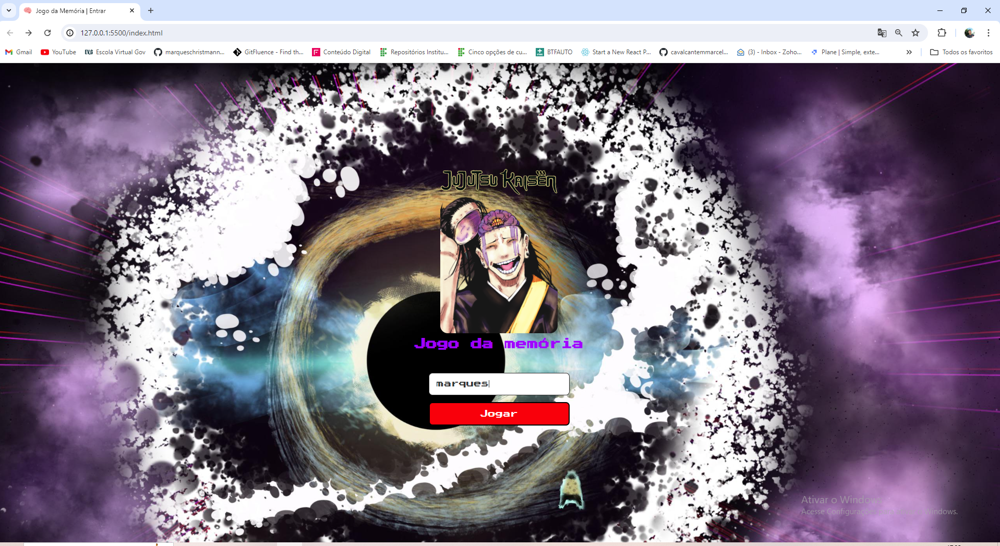
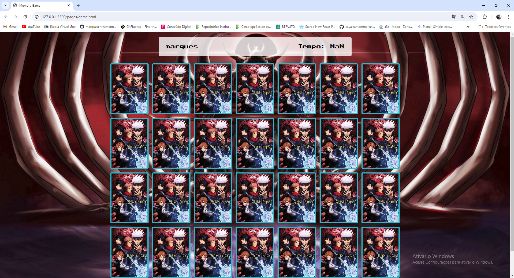

<h2 align="center">Portfólio Pessoal <br/> <a target="_blank" href="">MarquesChristman</a></h2>

<br/>

## Memory Game Jujutsu-Kaisen

Este é um jogo de memória onde o objetivo é encontrar todos os pares de cartas correspondentes no menor tempo possível.



<br/>



## Índice

- [Funcionalidades](#funcionalidades)
- [Tecnologias Utilizadas](#tecnologias-utilizadas)
- [Instalação](#instalação)
- [Como Jogar](#como-jogar)
- [Autor](#autor)

## Funcionalidades

- Início do jogo com um nome de jogador.
- Contagem de tempo desde o início do jogo.
- Embaralhamento aleatório das cartas.
- Verificação de pares de cartas.
- Exibição de mensagem de conclusão ao encontrar todos os pares.
- Botão de reinício para recomeçar o jogo.

## Tecnologias Utilizadas

- HTML5
- CSS3
- JavaScript

## Instalação

1. Clone o repositório para o seu computador:

   ```sh
   git clone https://github.com/seu-usuario/memory-game.git
   ```

2. Navegue até o diretório do projeto:

   ```sh
   cd Memória-Jujutsu-Kaisen
   ```

3. Abra o arquivo `index.html` no seu navegador:
   ```sh
   open index.html
   ```
   Ou simplesmente arraste o arquivo `index.html` para o navegador.

## Como Jogar

1. **Iniciar o Jogo:**

   - Abra o jogo em seu navegador.
   - Insira seu nome e clique em "Começar".

2. **Jogabilidade:**

   - Clique nas cartas para virá-las.
   - Tente encontrar todas os pares correspondentes.
   - O jogo termina quando todos os pares forem encontrados.

3. **Reiniciar o Jogo:**
   - Para reiniciar o jogo a qualquer momento, clique no botão "Reiniciar".

## Autor

Feito por [MarquesChristmann].

Sinta-se à vontade para contribuir com sugestões ou melhorias.
